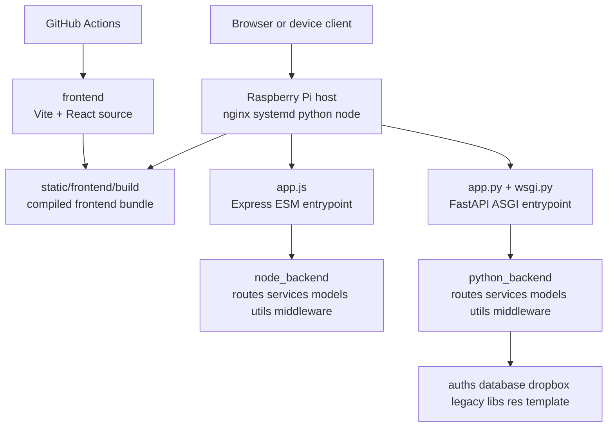

# Architecture

## System Diagram

## Layer Summary

- Root repo layer: deployment-facing files, entrypoints, workflow files, and shared static assets.
- `frontend`: Vite + React client source. The build target is `static/frontend/build`.
- `node_backend`: Express ESM route layer used by root `app.js` for server-level Node APIs.
- `python_backend`: FastAPI route layer used by root `app.py` for Python APIs plus legacy/support folders already present in the repo.

## Folder Naming Recommendation

- Keep `frontend` for the browser client. It is short, obvious, and standard.
- Use `node_backend` for the Express layer. It is explicit and avoids confusion with the Python API layer.
- Use `python_backend` for the FastAPI layer. It matches the repo language split and leaves room for a future `python_workers` folder if background jobs are added.
- Keep the repo root as the orchestration layer instead of renaming it. That is where `app.py`, `wsgi.py`, `app.js`, CI, and deployment files belong.

## Database Note

- The database engine is still unspecified. The scaffold keeps `python_backend/database` in place for adapters, local files, migrations, or model artifacts until the concrete database choice is finalized.
